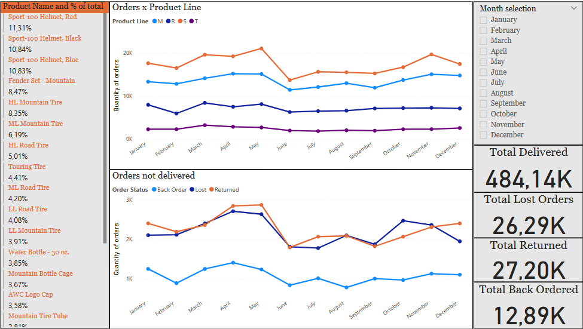

# Sales Performance Dashboard - Bicycle Parts Distributor

## 1. Project Overview

This Power BI dashboard provides a comprehensive analysis of sales performance for a fictional bicycle parts and accessories distributor. Developed using a sample dataset from a data analysis course, this project showcases the ability to transform raw sales data into actionable business insights.

The dashboard focuses on analyzing product sales by product line, tracking key performance indicators (KPIs), and identifying issues in the order fulfillment process.

---

## 2. Live Interactive Dashboard

### ➡️ [Click here to view and interact with the live dashboard](https://app.powerbi.com/reportEmbed?reportId=388d477b-8356-48e8-bbc8-5d2fedfbdc49&autoAuth=true&ctid=dee74457-d751-4011-a5c4-44560cf8b415)

---

## 3. Dashboard Preview

---

## 4. Key Features & Insights

This dashboard is broken down into several key analytical sections:

* **Product Line Performance (Orders x Product Line):**
    * Tracks the quantity of orders for each product line (M, R, S, T) on a monthly basis.
    * Allows for quick identification of top-performing product lines and seasonal trends.

* **Order Fulfillment Analysis (Orders not delivered):**
    * Visualizes the number of orders that were **Back-Ordered**, **Lost**, or **Returned**.
    * Helps identify months with high fulfillment issues, which could point to logistical or supply chain problems.

* **Top Product Contribution (% of total):**
    * A detailed table ranking individual products by their percentage contribution to the total quantity of orders.
    * Highlights "hero products" like the "Sport-100 Helmet" series.

* **High-Level KPIs:**
    * Clear, immediate metrics for **Total Delivered**, **Total Lost**, **Total Returned**, and **Total Back-Ordered** items.

* **Interactive Filtering:**
    * The dashboard can be dynamically filtered by **Month**, allowing for a focused analysis of specific time periods.

---

## 5. Tools Used

* **Power BI:** For data modeling, analysis, and dashboard creation.
* **DAX (Data Analysis Expressions):** Used for creating measures and calculated columns.
* **Source Data:** Sample dataset in `.csv` format.

---

## 6. Repository Contents

* **`/pbix/`:** Contains the Power BI source file (`.pbix`).
* **`/data/`:** Contains the raw sales dataset (`.csv`).
* **`/images/`:** Contains the static preview image of the dashboard.
